# Nova Stack: Schema & Relational Architecture Analysis

This document outlines the core data model and relational architecture of the Nova Stack CRM following the migration to a normalized, account-based (company-centric) structure.

## Schema Architecture Diagram

## Core Relational Philosophy
The CRM operates on an **Account-Based Architecture**. The `Company` is the central pillar of the data model. `Contacts`, `Deals`, `Tasks`, `Invoices`, and `Intake Submissions` all maintain foreign key relations (`companyId`) back to the company. This ensures that all activities, financials, and personnel can be rolled up and viewed comprehensively at the company level.

---

## 1. Core CRM Entities

### Companies (`companies`)
The central entity in the CRM.
* **Fields:** `id`, `name`, `industry`, `website`, `phone`, `address`, `city`, `country`, `notes`, `status` (*lead, active, inactive*), `userId` (Owner), `created_by`.
* **Relations:** One-to-Many with Contacts, Deals, Tasks, Invoices, and Intakes.

### Contacts (`contacts`)
Individuals who work at or represent a Company.
* **Fields:** `id`, `name`, `email`, `phone`, `title`, `notes`, `status`, `userId` (Owner), `assignedToId`.
* **Relations:** 
  * `companyId` -> Links to `companies`.
* *Note: The legacy flat-text `companyName` field is deprecated in favor of the `companyId` relation.*

### Deals / Projects (`deals`)
Sales opportunities or active projects.
* **Fields:** `id`, `title`, `value`, `stage` (*lead, contacted, quoted, won, lost*), `expectedCloseDate`, `notes`, `status`, `userId`, `assignedToId`.
* **Relations:**
  * `companyId` -> Links to `companies`.
  * `contactId` -> Links to `contacts` (The specific person championing the deal).

---

## 2. Operations & Financial Entities

### Tasks (`tasks`)
Actionable items or to-dos.
* **Fields:** `id`, `title`, `description`, `status`, `priority` (*low, medium, high*), `dueDate`, `userId`, `assignedToId`.
* **Relations:**
  * `companyId` -> Links to `companies`.
  * `contactId` -> Links to `contacts` (The person the task is about).
  * `dealId` -> Links to `deals` (The project the task belongs to).

### Invoices (`invoices`)
Financial records for billing.
* **Fields:** `id`, `title`, `invoiceNumber`, `amount`, `taxRate`, `status`, `issuedDate`, `dueDate`, `paidAt`, `userId`, `assignedToId`.
* **Data Structures:**
  * `lineItems`: Stored as an embedded JSON array `[{ productId, name, quantity, price, total }]`. This avoids complex relational joins for line items while maintaining robust invoice generation capabilities.
* **Relations:**
  * `companyId` -> Links to `companies`.
  * `contactId` -> Links to `contacts`.
  * `dealId` -> Links to `deals` (The project being billed).

### Products (`products`)
Catalog items that can be added as line items to invoices.
* **Fields:** `id`, `name`, `description`, `price`, `sku`, `status`.

---

## 3. Workflow & System Entities

### Intake Submissions (`intake_submissions`)
Incoming leads, tickets, or requests.
* **Fields:** `id`, `name`, `email`, `message`, `type` (*general, vacation, reimbursement, hardware*), `source` (*external, internal*), `status`, `reference`, `data` (JSON), `decisionNote`, `decidedAt`, `userId`, `assignedToId`.
* **Relations:**
  * Can optionally be linked to a `companyId` or `contactId` upon processing.

### Users (`users`)
System operators and employees.
* **Fields:** `id`, `name`, `email`, `role` (*admin, hr, user*).

### Audit Logs (`audit_logs`)
System tracking for security and history.
* **Fields:** `id`, `entityType`, `entityId`, `action` (*create, update, delete*), `actorId`, `changes` (JSON).

---

## Technical Implementation Notes
* **Strict Foreign Keys:** To ensure data integrity, forms enforce mandatory selections for critical relations (e.g., Tasks must have a linked Contact/Deal; Invoices must have a linked Deal).
* **Cascading UI:** By adhering to this schema, the UI easily supports "Timeline" and "Profile" views (e.g., viewing a Company shows all related Contacts, Deals, Tasks, and Invoices automatically).
